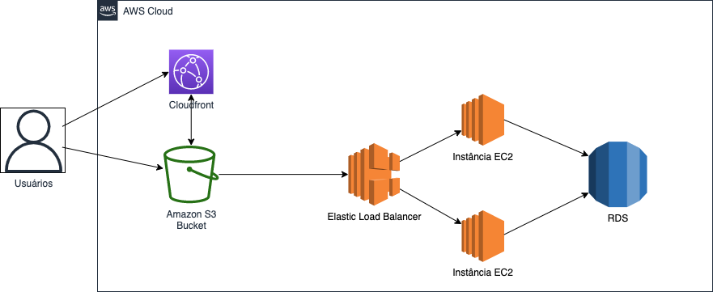

# Arquitetura AWS para Comércio Eletrônico

## Descrição da Arquitetura

A seguir, é apresentada uma proposta de arquitetura na AWS para uma empresa de comércio eletrônico que deseja migrar sua aplicação. A arquitetura visa oferecer escalabilidade, alta disponibilidade e desempenho para o site de vendas online.

### Componentes da Arquitetura

1. **Aplicação Web**: A aplicação web é o front-end do site de comércio eletrônico, onde os clientes podem navegar pelos produtos, adicionar itens ao carrinho de compras e fazer o checkout. Ela é hospedada em um bucket S3.

2. **Amazon CloudFront**: O CloudFront é um serviço de CDN (Content Delivery Network) que armazena em cache o conteúdo estático, como imagens e arquivos CSS/JS, e o distribui globalmente em servidores próximos aos usuários finais. Isso melhora a velocidade de carregamento do site e reduz a latência.

3. **Elastic Load Balancer**: O Elastic Load Balancer distribui o tráfego de entrada entre várias instâncias do EC2, garantindo alta disponibilidade e escalabilidade. Ele gerencia automaticamente a adição ou remoção de instâncias com base na carga de tráfego.

4. **Servidores de Aplicação (EC2)**: Os servidores de aplicação executam a lógica de negócios do site de comércio eletrônico. Eles se comunicam com o banco de dados, processam os pedidos e respondem às requisições dos clientes. A quantidade de instâncias do EC2 pode ser dimensionada automaticamente usando Auto Scaling para lidar com a demanda crescente.

5. **Banco de Dados (RDS)**: O banco de dados armazena informações sobre os produtos, clientes, pedidos e outras informações relevantes para o site de comércio eletrônico. Utilize o Amazon RDS para hospedar um banco de dados relacional altamente disponível, como o MySQL ou PostgreSQL. O RDS gerencia a replicação, backups e escalabilidade do banco de dados.

## Benefícios

- Escalabilidade automática para lidar com picos de tráfego.
- Alta disponibilidade com a distribuição de carga e tolerância a falhas.
- Desempenho aprimorado com a entrega de conteúdo estático via CDN.
- Gerenciamento simplificado do banco de dados com o RDS.

## Desafio

Criar um código baseado no conceito de Infrastructure as Code (Terraform, Cloudformation e etc) que realize a criação de toda a arquitetura proposta levando em consideração as melhores práticas de requisitos de desempenho, escalabilidade, segurança e custo.

O código deve ser entregue em um projeto do GitHub.

==**Não é necessário criar a aplicação proposta no desafio, apenas a infraestrutura necessária**==
